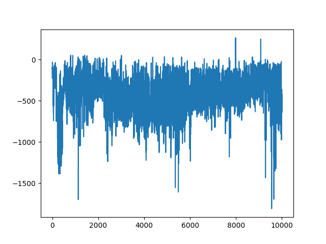
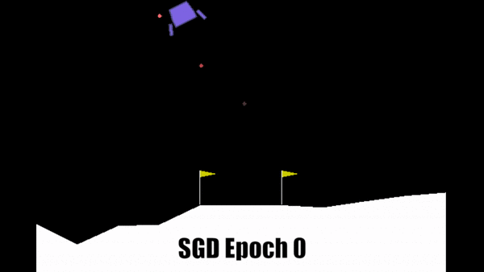
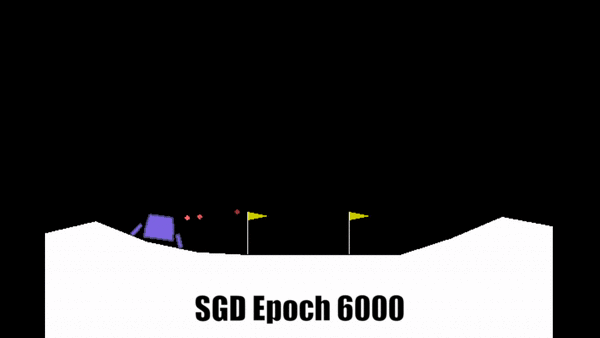
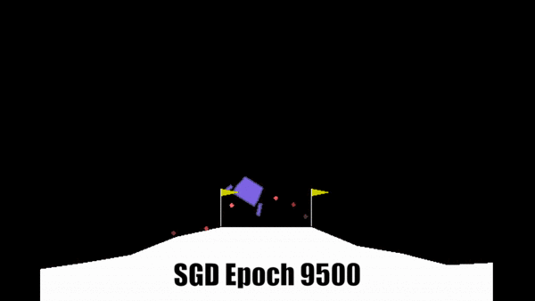
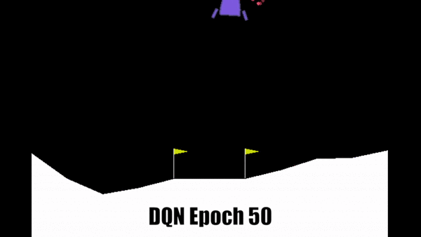
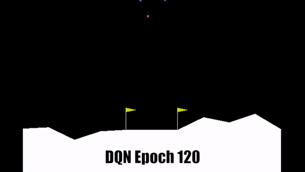
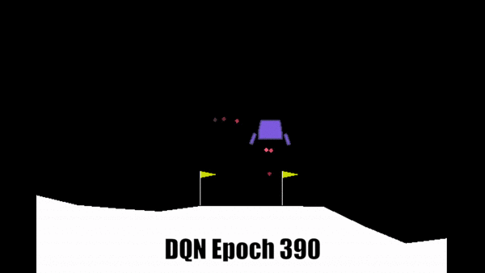
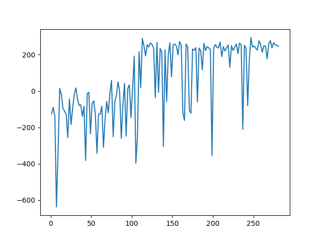

# Lab 3 Reinforcement Learning

The Task of this lab was to evaluate three algorithems of out choice on the OpenAI gym "LunarLander-v2"

# Source

This Repo is forked from the official OpenAI Repo. Please find the original Repo here: https://github.com/openai/gym

# Random hill climbing
## How does Random hill climbing work?
"Like a climber in thick fog searching to the peak". This algortithing always looks for the steepest uphill path from its current position. If there are only downhill paths he asumes to be at the peak. The Problem is obivous: When the algorithem finds the second greatest peak (local maxima), he asumes to be at the end. That is why this algorithem needs to be restartet, if it found a peak and still does not succeed.

## Where is it used?
* optimization problems

## How did it perform?
Even after 10.000 iterations RHC was not able to solve the gym:
```
episode: 9999/10000, score: -677.2669869361765
Average over last 100 episode: -478.05
```
Even after thouends of iterations, there is no real trend visible in the reward data:


This is even more obivous in the avaraged version (average over last 100 episodes):
")

# Stochastic gradient descent (SGD)
Inspired by this repo: https://github.com/keon/policy-gradient
## How does SGD work?
SGD is a stochastic approximation of gradient descent. It replaces the actual gradient with an estimate. This allowes for faster interations in trade for a lower convergance rate. A normal run of gradient descent works with the following steps:
1. Compute the gradient of the given function with all parameters
2. Pick a random start value for each paramenter
3. Update the gradient with the start values
4. Calculate the step size: `step size = gradient * learning rate`
5. Calculate the new parameters: `new params = old params -step size`
6. Loop step 3-5 until the slope is almost 0

SGD now adds more randomness to reduce the number of computations needed. This is archived by randomly picking data points from the whole set during each iteration.

## Where is it used?
* optimization problems

## How did it perform?
Even after close to 10.000 epochs the algorithem was not able to get an positive average.
```
episode: 9875/10000, score: -170.62709316449394
Average over last 100 episode: -198.05
```
It is clearly possible to see an improvement over time, but after more then 10h of training the goal of the gym was not met:
TODO learning curve
")


Here are some recordings while training:





And the final result:



# DQN Deep Q Learning
Inspired by this blogpost: https://towardsdatascience.com/solving-lunar-lander-openaigym-reinforcement-learning-785675066197

## How does DQN work?
Normal Q-Learning uses a map that links each state of the enviroment to a action. All pairs are in a table and mapped to thier coresponting Q-value.

Deep Q-Learning adds a nural network, wich maps tje input states to action and Q-value pairs. After each action a Deep Q-Learnign agent will use experience replay to learn more about their enviroment and will update thier weight and therefore the netwok.

## Where is it used?
* Google’s Cloud AutoML
* Facebook’s Horizon Platform

## How did it perform?
The first results where visible after about 50 epochs:



(5x speed)

After about 120-130 epochs the landins where quite reliable:


(5x speed)

The goal of the gym (avg score over last 100 >= 200) was met after 368 epochs:
```
episode: 364/400, score: 252.3769125805014
Average over last 100 episode: 198.88

episode: 365/400, score: 275.1089156449221
Average over last 100 episode: 199.20

episode: 366/400, score: 234.95311973015984
Average over last 100 episode: 199.08

episode: 367/400, score: 284.25774986650066
Average over last 100 episode: 199.26

episode: 368/400, score: 289.02234192240275
Average over last 100 episode: 199.76

 Task Completed!
```

The final result was able to land nearly every time:



(5x speed)

Progress graph (X-Axsis: Epoch; Y-Axsis: Score):



# Results

Only the DQN algorithem was able to solve the gym, but it was also the slowest taking up to a minute for a single episode. The results after a few iterations were better then the results of the other two after close to 10.000 episodes.
