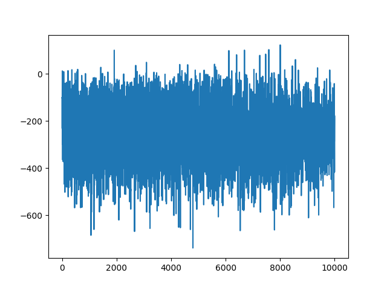

# Lab 3 Reinforcement Learning

The Task of this lab was to evaluate three algorithms of out choice on the OpenAI gym "LunarLander-v2"

# Source

This Repo is forked from the official OpenAI Repo. Please find the original Repo here: https://github.com/openai/gym

# Random hill climbing
## How does Random hill climbing work?
"Like a climber in thick fog searching to the peak". This algorithm always looks for the steepest uphill path from its current position. If there are only downhill paths, he assumes to be at the peak. The Problem is obvious: When the algorithm finds the second greatest peak (local maxima), he assumes to be at the end. That is why this algorithm needs to be restarted, if it found a peak and still does not succeed.

## Where is it used?
* optimization problems

## How did it perform?
Even after 10.000 iterations RHC was not able to solve the gym:
```
episode: 9999/10000, score: -677.2669869361765
Average over last 100 episode: -478.05
```
Even after thousands of iterations, there is no real trend visible in the reward data:


This is even more obvious in the averaged version (average over last 100 episodes):
")

# Stochastic gradient descent (SGD)
Inspired by this repo: https://github.com/keon/policy-gradient
## How does SGD work?
SGD is a stochastic approximation of gradient descent. It replaces the actual gradient with an estimate. This allows for faster iterations in trade for a lower convergence rate. A normal run of gradient descent works with the following steps:
1. Compute the gradient of the given function with all parameters
2. Pick a random start value for each parameter
3. Update the gradient with the start values
4. Calculate the step size: `step size = gradient * learning rate`
5. Calculate the new parameters: `new params = old params -step size`
6. Loop step 3-5 until the slope is almost 0

SGD now adds more randomness to reduce the number of computations needed. This is archived by randomly picking data points from the whole set during each iteration.

## Where is it used?
* optimization problems

## How did it perform?
Even after close to 10.000 epochs the algorithm was not able to get a positive average.
```
episode: 9875/10000, score: -170.62709316449394
Average over last 100 episode: -198.05
```
It is clearly possible to see an improvement from epoch 8000 onwards, but after more than 10h of training the goal of the gym was not met:

")

The not averaged version also shows that even after 8000 epochs there is no consistency.



Here are some recordings while training:


And the final result:


# DQN Deep Q Learning
Inspired by this blogpost: https://towardsdatascience.com/solving-lunar-lander-openaigym-reinforcement-learning-785675066197

## How does DQN work?
Normal Q-Learning uses a map that links each state of the environment to an action. All pairs are in a table and mapped to their corresponding Q-value.

Deep Q-Learning adds a neural network, which maps the input states to action and Q-value pairs. After each action a Deep Q-Learning agent will use experience replay to learn more about their environment and will update their weight and therefore the network.

## Where is it used?
* Google’s Cloud AutoML
* Facebook’s Horizon Platform

## How did it perform?
The first results were visible after about 50 epochs:


(5x speed)

After about 120-130 epochs the landins where quite reliable:


(5x speed)

The goal of the gym (avg score over last 100 >= 200) was met after 368 epochs:
```
episode: 364/400, score: 252.3769125805014
Average over last 100 episode: 198.88

episode: 365/400, score: 275.1089156449221
Average over last 100 episode: 199.20

episode: 366/400, score: 234.95311973015984
Average over last 100 episode: 199.08

episode: 367/400, score: 284.25774986650066
Average over last 100 episode: 199.26

episode: 368/400, score: 289.02234192240275
Average over last 100 episode: 199.76

 Task Completed!
```

The final result was able to land nearly every time:


(5x speed)

In a second run the algorithm reached the goal even sooner after 280 epochs. Progress graph (X-Axis: Epoch; Y-Axis: Score):


The lerning progress is even better shown by the averaged version:


# Results

Only the DQN algorithm was able to solve the gym, but it was also the slowest taking up to a minute for a single episode. The results after a few iterations were better than the results of the other two after close to 10.000 episodes.
